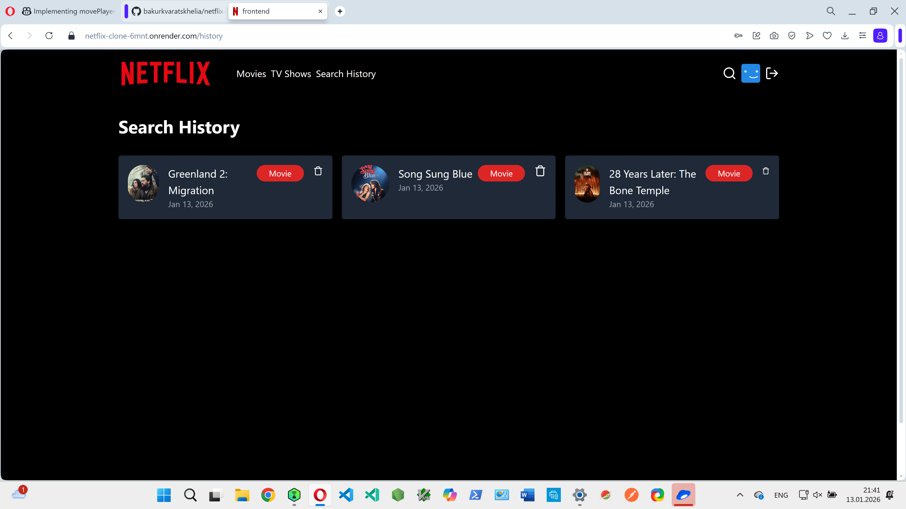

# Netflix Clone

A visually polished, full-stack **Netflix clone web application** that replicates the look, feel, and core functionality of the Netflix streaming platform.  
This project showcases modern web app skills, responsive design, and practical full-stack development.

---

## Features

- User authentication (sign up & log in)
- Browse, search, and filter movies
- Play trailers (or video previews)
- Add and manage favorites/watchlist
- Responsive design (desktop, tablet, and mobile)
- Persistent user state
- Custom Netflix-style UI & animations
- Demo user for quick testing

---

## Tech Stack

- **Frontend:** React, CSS/Styled-Components, JavaScript  
- **Backend:** Node.js, Express, MongoDB (or another database as appropriate)  
- **Authentication:** JWT or OAuth (configured in server)  
- **API:** TMDb or similar for movie data (optional custom API for learning)

---

## Homepage


## Login Page


## Signup Page


## Movie Page


## TV Shows Page


## Watch History



## Error Page


## Project Structure

```
netflix-clone/
├── client/           # React app—UI, components, pages
├── server/           # Backend API (Express, database models)
├── public/           # Static assets (logos, etc.)
├── screenshots/      # App screenshots
├── package.json      # Project metadata/scripts
└── ...
```

---

## Installation & Running Locally

### Prerequisites
- **Node.js** >= 18
- **npm** (or yarn)
- **MongoDB** (cloud/local) (if backend persists data)

### 1. Clone the repository

```bash
git clone https://github.com/bakurkvaratskhelia/netflix-clone.git
cd netflix-clone
```

### 2. Setup the Backend

```bash
cd server
npm install
# Create a `.env` file with your database and JWT settings
npm start          # or: npm run dev
```

### 3. Setup the Frontend

```bash
cd ../client
npm install
npm start
```
- The frontend will open at `http://localhost:3000` (by default).

---

## Why This Project?

Building a Netflix clone was a practical exercise in modern full-stack development and responsive UI/UX design.  
Key objectives:
- Recreate a complex, real-world streaming interface
- Understand secure authentication and data flows
- Practice performant API/data handling and real-time UI updates

---

## License

This project is licensed under the MIT License.  
See the [LICENSE](./LICENSE) file for details.

---

## Contact

- GitHub: [bakurkvaratskhelia](https://github.com/bakurkvaratskhelia)
- For demo requests, questions, or collaboration, feel free to [open an issue](https://github.com/bakurkvaratskhelia/netflix-clone/issues) or contact me directly.
